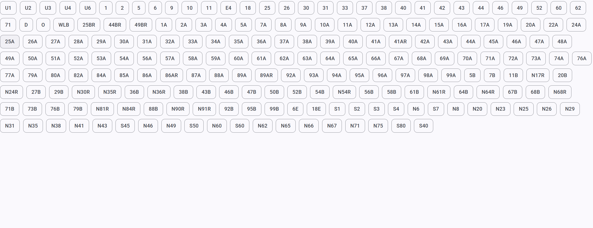
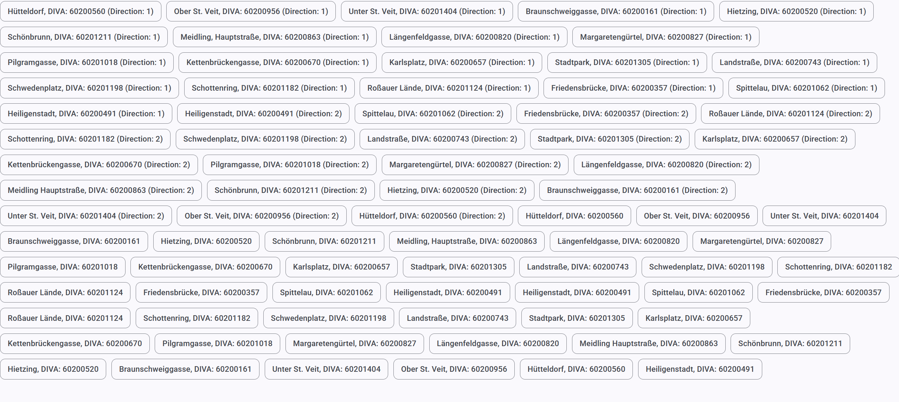
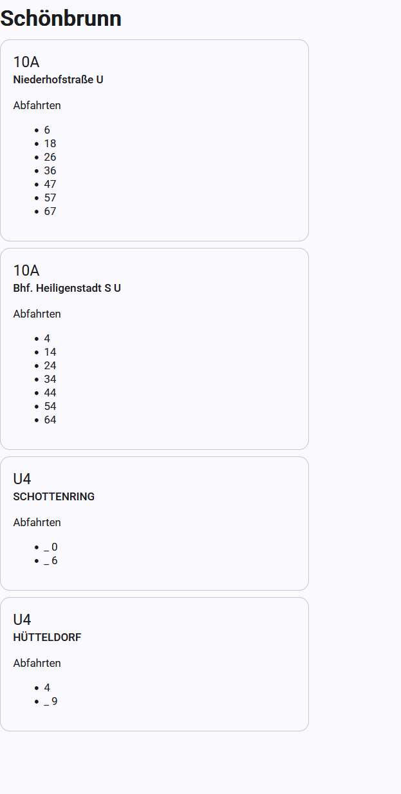

# wl-monitor
Next-Gen high quality fully-featured perfectly perfect artisan crafted departure monitor for Wiener Linien.

## Screenshots
Line selector

Stop selector

Departure monitor

## Running

Run the backend with `fastapi dev` (after installing fastapi with `pip install "fastapi[standard]"`). For production, run with `fastapi run` (but I really can't imagine why someone would want to do that).

Run the frontend with `npm start`.

If any problems emerge, read the docs, they can be found via the search engine of your choice.

# License
WTFPL
